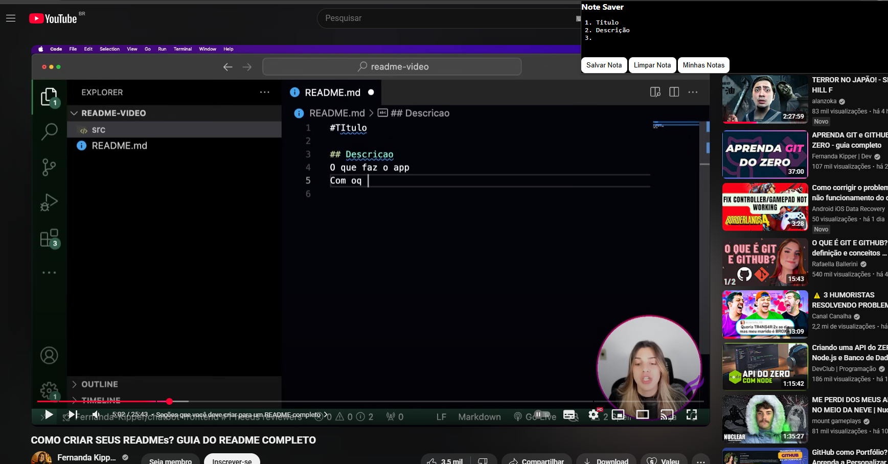
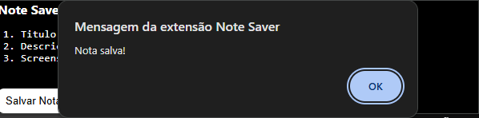
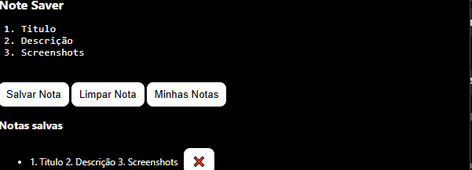

# 📔 Note Saver

**Proposito:**  Uma extensão para Google Chrome (Manifest V3), que salva e exibe suas notas sem que voce precise de varios aplicativos.

# 📖 Sobre o Projeto

*Ja aconteceu de anotar algo no caderno ou no bloco de notas e simplesmente esqueceu em qual pagina anotou ou salvou o arquivo? Bom seus problemas acabaram. O Note Saver estar aqui para isso.

*Sendo feito seguindo as diretrizes do google extensões , utilizando o Minifest V3*

# 🖼️ Screenshots

**Para anotar pontos em videos**

**Aviso de nota salva**

**Visualização das notas salvas**

# ⚙️ Funcionalidades

*Poder salvar suas anotações a qualquer momento sem precisar abrir nenhum aplicativo exteerno.*

*Interface: Um Icone discreto fica visível no canto da tela, sem atrapalhar a navegação.*

*Popup: Clique no ícone da extensão para poder abrir e usa-la*

*Persistência de Dados: As notas registradas são salvas localmente no seu navegador, então as notas Continuam mesmo após fechar e reabrir o Chrome.*

# 📝 Instalação (Modo Desenvolvedor)

 *Baixe o código*

*Clone este repositório: git clone https://github.com/[SEU-USUARIO]/[SEU-REPOSITORIO].git*

*Ou baixe o arquivo .zip pela página de Releases.*

*Descompacte o arquivo, caso tenha baixado o .zip.*

*Abra o Google Chrome e navegue até a página de extensões: chrome://extensions.*

*Ative o Modo de Desenvolvedor (Developer mode) no canto superior direito da página.*

*Clique em "Carregar sem compactação" (Load unpacked) e selecione a pasta raiz do projeto que você baixou.*

# 📜 Tecnologias Utilizadas

HTML5

CSS3

JavaScript (ES6+)

Chrome Extension API (Manifest V3)

📄 Licença
Este projeto está distribuído sob a licença MIT. Veja o arquivo LICENSE para mais detalhes.
